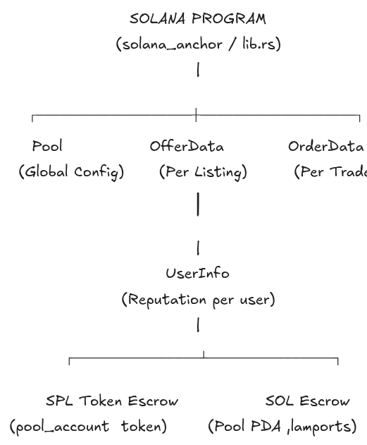
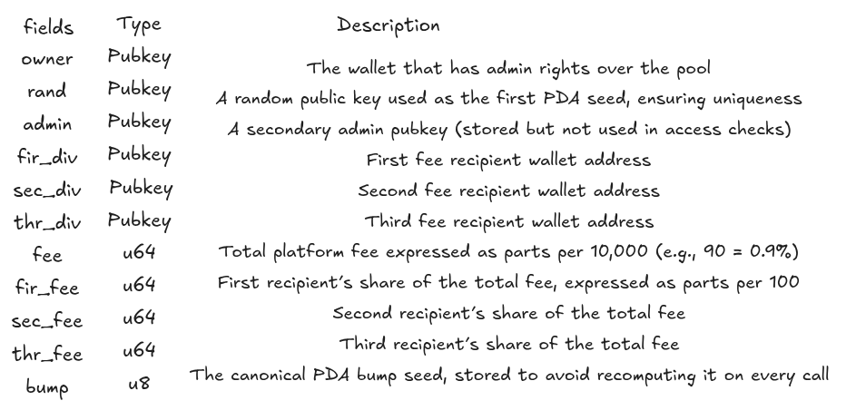
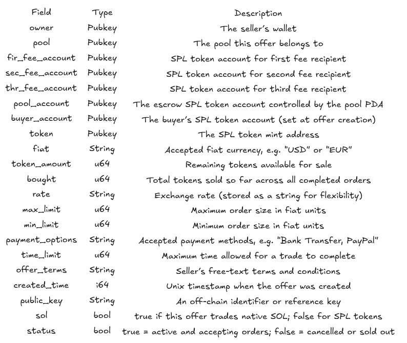
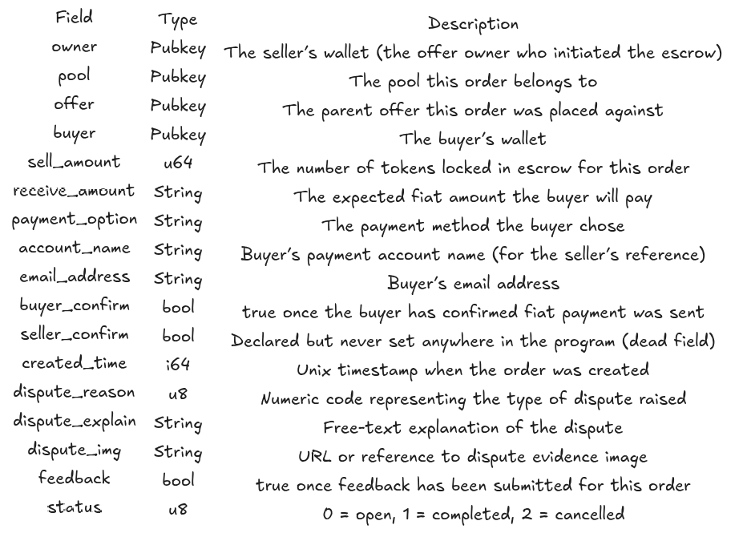
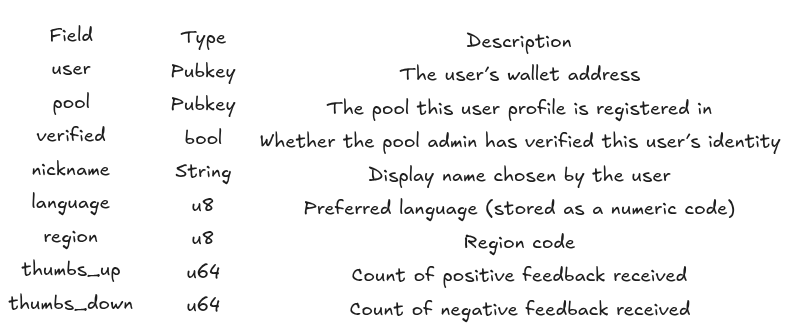
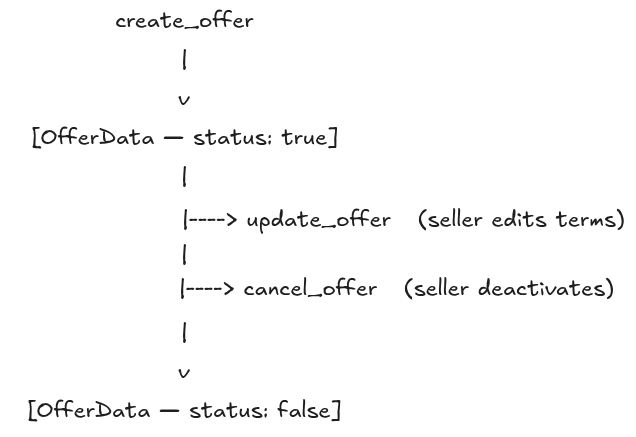
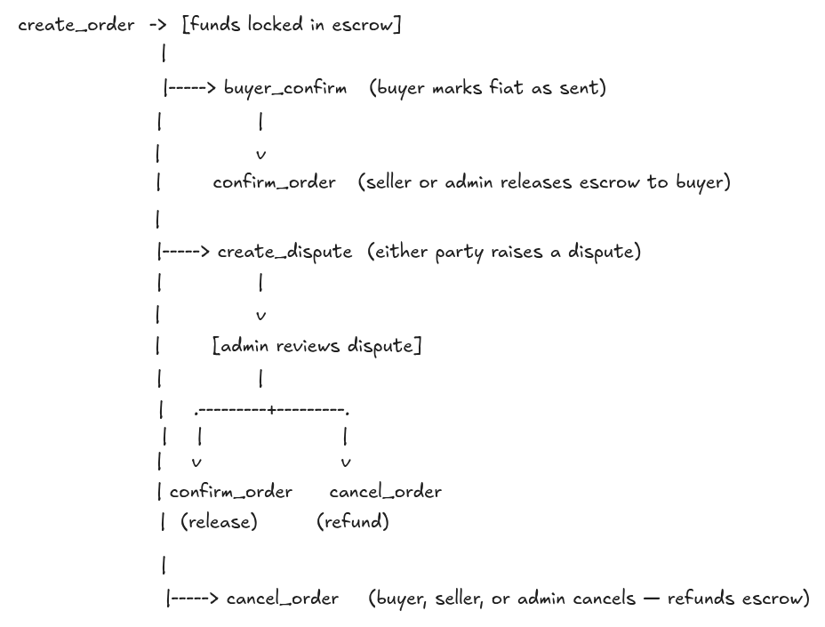
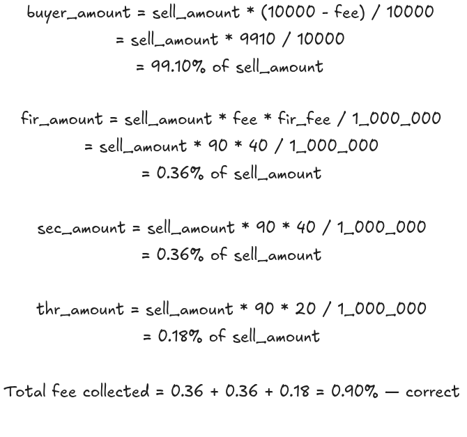

# Smart Contract Analysis MansaTrade 

---

## 1. Project Overview

This repository contains a **Peer-to-Peer (P2P) token trading smart contract** on the Solana blockchain. Its purpose is to allow any two parties to trade Solana-based tokens (both SPL tokens and native SOL) against fiat currency, using an on-chain escrow model.

The core capabilities of the contract are:

- A seller creates an offer specifying the token, amount, fiat currency, exchange rate, and payment options.
- A buyer places an order against that offer, which locks the seller's tokens in a program-controlled escrow account.
- Once the buyer sends the fiat payment off-chain and confirms this on-chain, the seller releases the tokens to the buyer.
- If either party disagrees, a dispute can be raised and the pool owner (admin) can intervene.
- Users accumulate a reputation score through a thumbs up / thumbs down feedback system attached to completed orders.
- A configurable fee is deducted from each completed trade and distributed across three platform dividend wallets.

---

## 2. Repository Structure

```
.
├── lib.rs          # Main program - instructions, account structs, error definitions
└── utils.rs        # Transfer utility functions , SPL token and SOL CPI wrappers
```

**lib.rs** defines all program instructions (the public API of the smart contract), the on-chain account data structures, and the custom error enum.

**utils.rs** contains low-level helper functions that wrap Cross-Program Invocation (CPI) calls into the SPL token program and the System program. These helpers are used by the instruction handlers in `lib.rs` to move tokens and SOL.

---

## 3. Architecture Overview



### Key Design Decisions

**Escrow via PDA.** The `Pool` account is a Program Derived Address (PDA), meaning it is controlled exclusively by the program itself. When a seller locks tokens into escrow, they are transferred to a token account whose authority is this PDA. No external wallet can move those tokens , only the program can, using `invoke_signed` with the PDA's seeds.

**Dual asset support.** Every instruction that moves value has two branches: one for SPL tokens and one for native SOL. The `sol` boolean field on `OfferData` determines which branch executes. SPL transfers go through the SPL token program via CPI; SOL transfers directly mutate lamport balances on the PDA (the correct pattern for program-owned accounts).

**Three-way fee distribution.** When a trade completes, the platform fee is split across three configurable wallet addresses (`fir_div`, `sec_div`, `thr_div`). The proportion each receives is stored as separate percentage fields on the `Pool` account, allowing the admin to reconfigure the split without redeploying.

**Separation of offer and order.** An offer is a standing advertisement. An order is a live trade created against an offer. This separation means a single offer can be partially filled across multiple orders, with the remaining `token_amount` decremented on each completion.

---

## 4. Data Structures

### 4.1 Pool

The `Pool` account is the global configuration for the entire program. There is one pool per deployment. It acts as both a configuration store and the PDA authority for escrow operations.



The PDA address is derived using `seeds = [rand.key]` and the stored `bump`. Default fee configuration at initialization: total fee of 90 basis points (0.9%), split 40 / 40 / 20 across the three recipients.

**Allocated size:** `POOL_SIZE = 32 + 32 + 32 + 32 + 32 + 32 + 8 + 8 + 8 + 8 + 1 = 225 bytes`

---

### 4.2 OfferData

Each active sell offer creates one `OfferData` account. This stores everything the buyer needs to evaluate the offer and everything the program needs to execute a trade.



---

### 4.3 OrderData

Each live trade creates one `OrderData` account. It tracks the state of a single buyer-seller transaction from escrow lock to completion or cancellation.



---

### 4.4 UserInfo

Each registered user has one `UserInfo` account, scoped to a specific pool. It stores identity metadata and the user's reputation counters.



## 5. Program Instructions

### 5.1 Pool Management

**`init_pool`**  
Initializes the pool PDA. Anyone can call this to create a new pool, which becomes the escrow authority for all trades under it. Sets the fee to 90 (0.9%) with a 40/40/20 split by default. The PDA is derived from the provided `rand` key and a bump seed.

**`update_pool`**  
Allows the pool owner to update the three dividend wallet addresses and all fee parameters. Includes an ownership check: `*ctx.accounts.owner.key != pool.owner` returns `NotAdmin` if the caller is not the owner. This is one of the few functions in the contract that correctly enforces authorization.

---

### 5.2 Offer Lifecycle



**`create_offer`**  
Creates a new `OfferData` account. Records the seller's configuration including fiat, rate, limits, payment options, and whether the offer is for SOL or an SPL token. No funds are transferred at this stage , the offer is purely a listing. Sets `status = true` and `bought = 0`.

**`update_offer`**  
Allows editing of the core offer parameters. Does not currently verify that the caller is the offer's owner — any signer can modify any offer (see Bugs section).

**`cancel_offer`**  
Sets `offer_data.status = false`. Does not return any escrowed funds because no funds are held at the offer level. Does not verify caller ownership (see Bugs section).

---

### 5.3 Order Lifecycle



**`create_order`**  
Validates that the requested `sell_amount` does not exceed the offer's `token_amount`. Then transfers the tokens (or SOL) from the seller's wallet into escrow. Sets `status = 0`, `buyer_confirm = false`, `seller_confirm = false`. Records buyer payment details for the seller's reference.

**`buyer_confirm`**  
Can only be called by the wallet matching `order_data.buyer`. Sets `buyer_confirm = true`, indicating the buyer has sent fiat payment and is requesting token release.

**`confirm_order`**  
The most complex instruction. Can be called by the seller (`order_data.owner`) or the pool admin (`pool.owner`). Checks that `buyer_confirm` is `true` before proceeding. Transfers tokens from escrow to the buyer minus the platform fee, then splits the fee across the three dividend accounts. Decrements `offer_data.token_amount` and increments `offer_data.bought`. Sets `order_data.status = 1`.

**`cancel_order`**  
Can be called by the buyer, seller, or pool admin. Checks that the order is not already completed (`status != 1`). Returns the full `sell_amount` back to the seller from escrow. Sets `order_data.status = 2`.

**`create_dispute`**  
Can be called by either the buyer or seller. Records a `dispute_reason` code, a text explanation, and an image reference. Does not change the order's `status` , the escrow remains locked. Resolution is expected to happen via `confirm_order` or `cancel_order` called by the admin.

---

### 5.4 User Management

**`create_user`**  
Registers a new `UserInfo` account for a given wallet. Sets `verified = false` and zero reputation counters. Anyone can create a user profile for any wallet.

**`verify_user`**  
Sets `verified = true` on a user profile. Correctly restricted to the pool owner via an ownership check.

**`update_user`**  
Updates a user's nickname, language, and region. Does not verify that the caller owns the profile being updated (see Bugs section).

**`thumb_user`**  
Increments either `thumbs_up` or `thumbs_down` on a `UserInfo` account and sets `order_data.feedback = true`. Has no authorization checks and no validation that the order is complete (see Bugs section).

**`withdraw`**  
Transfers SPL tokens or SOL out of the pool escrow to a specified user account. Has no ownership check , any wallet can call this and drain the pool (see Bugs section).

---

## 6. Utils Module : Deep Dive

### 6.1 Why Custom Transfer Wrappers

The comments in `utils.rs` repeatedly ask why custom structs and functions are needed instead of "regular transfer" methods. The answer is rooted in how Solana's runtime works.

Solana does not have a universal "transfer value" opcode. Moving SPL tokens between accounts requires invoking the **SPL Token program**  a separate on-chain program  via a Cross-Program Invocation (CPI). This involves building an instruction object, specifying all accounts that must be passed, and calling either `invoke` or `invoke_signed`. Without wrappers, this boilerplate would be repeated verbatim at every call site in `lib.rs`.

The custom structs (`TokenTransferParams`, `SolTransferParams`, etc.) serve as typed, named parameter bundles. Instead of passing six individual arguments and risking argument order mistakes, the caller constructs a well-named struct and passes it once. This makes call sites in `lib.rs` readable and makes the intent of each transfer immediately clear.

The custom functions (`spl_token_transfer`, `sol_transfer`, etc.) encapsulate the CPI boilerplate and map all possible errors to the program's own `PoolError` variants, ensuring consistent error handling throughout the program.

---

### 6.2 invoke vs invoke_signed

There are two fundamentally different transfer scenarios in this contract, and they require different CPI mechanisms:

**Scenario A : User is the authority (depositing into escrow)**  
When the seller locks tokens into escrow during `create_order`, the seller's wallet is the token account authority. The seller has already signed the transaction. The runtime can verify the signature normally. In this case `invoke` is used  the existing transaction signature is sufficient.

**Scenario B : Pool PDA is the authority (releasing from escrow)**  
When the program releases escrowed funds during `confirm_order` or `cancel_order`, the pool PDA is the authority over the escrow token account. A PDA has no private key and therefore cannot sign transactions. The Solana runtime provides a special mechanism: a program can assert that a PDA it controls is effectively signing, by providing the seeds that derive that PDA. This is done with `invoke_signed`, which takes an additional argument `&[authority_signer_seeds]`. The runtime re-derives the PDA from those seeds, confirms it matches the authority in the instruction, and allows the transfer to proceed.

| | `invoke` | `invoke_signed` |
|---|---|---|
| Authority type | Real keypair (user) | Program Derived Address |
| Signature source | Transaction signer | Program-provided seeds |
| Used for | Depositing into escrow | Releasing from escrow |
| Used in | `create_order` | `confirm_order`, `cancel_order`, `withdraw` |

---

### 6.3 Function Reference

**`spl_token_transfer(params: TokenTransferParams)`**  
Transfers SPL tokens from a PDA-controlled source account to a destination. Uses `invoke_signed` with `authority_signer_seeds`. Called when the program is releasing escrowed tokens (confirm or cancel). The `TokenTransferParams` struct includes `authority_signer_seeds: &'b [&'b [u8]]`, which carries the pool's PDA seeds. The lifetime annotation `'a: 'b` expresses that the account lifetime must outlive the seed reference lifetime.

**`spl_token_transfer_without_seed(params: TokenTransferParamsWithoutSeed)`**  
Transfers SPL tokens from a user-owned account. Uses `invoke` since the user's wallet is the authority and the user signed the transaction. Called in `create_order` when the seller deposits into escrow. The struct omits `authority_signer_seeds` since none are needed.

**`sol_transfer(params: SolTransferParams)`**  
Moves native SOL out of a PDA. Does not use `system_instruction::transfer` or any CPI at all. Instead, it directly mutates the lamport fields of both accounts:
```rust
**source.try_borrow_mut_lamports()? -= amount;
**destination.try_borrow_mut_lamports()? += amount;
```
This works because the program owns the pool PDA and is therefore permitted to modify its lamports. The system program cannot sign for a PDA, so `system_instruction::transfer` would fail. A balance check is performed before subtraction to prevent underflow and return `InsufficentFunds` cleanly.

**`sol_transfer_without_seed(params: SolTransferParamsWithoutSeed)`**  
Moves native SOL from a user wallet using `system_instruction::transfer` via `invoke`. The user has signed the transaction, so the system program accepts the transfer. Used in `create_order` when the seller deposits SOL into the pool PDA.

**`spl_token_set_authority(params: TokenSetAuthorityParams)`**  
Changes the owner of a token account. Uses `invoke` since the current authority is a real signer. Changes authority type to `AccountOwner`. This function is defined in `utils.rs` but is not called anywhere in `lib.rs` in the current version — it is dead code.

**`spl_token_mint_to(params: TokenMintToParams)`**  
Mints new SPL tokens to an account. Uses `invoke` since the mint authority is a real signer. Also not called anywhere in `lib.rs` in the current version — dead code.

---

### 6.4 inline(always) Explained

Every function in `utils.rs` is annotated with `#[inline(always)]`. This is a compiler directive that instructs the Rust compiler to always substitute the function body directly at each call site, rather than generating a real function call with its own stack frame.

In general Rust code this is used sparingly, since it increases binary size. In the context of Solana smart contracts it is a deliberate optimization for two reasons.

First, Solana programs have a compute unit budget of 200,000 CUs per transaction by default. Every instruction executed, every stack frame set up, and every branch taken consumes compute units. Eliminating Rust-level function call overhead — saving the stack push, the jump instruction, and the return — is a genuine cost saving when the program is doing multiple transfers in a single instruction such as `confirm_order`, which performs four separate CPI calls.

Second, these functions are small and called at most two or three times per instruction. Inlining a small function that is called infrequently does not cause code bloat and has no downside. If the functions were called in a tight loop across many iterations, the tradeoff would need reconsideration, but that is not the case here.

The `#[inline(always)]` annotation is not about correctness — the program would produce the same results without it. It is purely a performance and cost optimization appropriate for on-chain code.

---

### 6.5 map_err and the |_| Closure

The following pattern appears throughout `utils.rs`:

```rust
result.map_err(|_| PoolError::TokenTransferFailed.into())
```

`result` here is of type `Result<(), ProgramError>`, returned by `invoke` or `invoke_signed`. `Result` is Rust's standard type for operations that can either succeed (`Ok(value)`) or fail (`Err(error)`).

`.map_err(f)` is a method on `Result` that leaves `Ok` values unchanged and applies the function `f` to the inner error value if the result is `Err`. It is used to transform the error type without affecting success paths.

`|_|` is a Rust closure (anonymous function). The `|` characters delimit the parameter list, and `_` is the parameter name, which by convention means "I am intentionally ignoring this value." The closure receives the original `ProgramError` from the CPI call and discards it, returning a new error instead.

`PoolError::TokenTransferFailed.into()` converts the custom error enum variant into the `ProgramError` type that Solana's runtime expects at instruction boundaries.

The reason for discarding the original error rather than propagating it is that Solana does not reliably carry rich error information across CPI boundaries. A raw `ProgramError` from the SPL token program would surface as a numeric code that is difficult for clients to interpret. Replacing it with a named variant from the program's own error enum gives callers a meaningful, program-specific signal. For debugging during development, the original error is still visible in the transaction simulation logs even when it is replaced at the Rust level.

In plain terms: if the SPL token transfer fails for any reason — wrong account, insufficient balance, wrong authority , the program returns `TokenTransferFailed` to the caller instead of whatever raw error the SPL program produced.

---

### 6.6 Direct Lamport Mutation

The `sol_transfer` function manipulates lamports directly:

```rust
if **source.try_borrow_lamports()? < amount {
    return Err(PoolError::InsufficentFunds.into());
}
**source.try_borrow_mut_lamports()? -= amount;
**destination.try_borrow_mut_lamports()? += amount;
```

The double dereference (`**`) is required because `try_borrow_mut_lamports()` returns a `RefMut<&mut u64>`, and the inner `&mut u64` needs to be dereferenced to read and write the value.

This is the correct and intended pattern for moving SOL out of a PDA on Solana. The `system_instruction::transfer` instruction requires the source account to be a system-owned account whose owner is the System Program. A PDA's owner is the program that derived it, not the System Program, so the system program would reject any attempt to transfer SOL out of it. The program-level lamport mutation bypasses this restriction because the owning program is directly authorized to change its own accounts' balances.

The balance check before mutation is important: if the check were absent and the subtraction underflowed a `u64`, the lamports would wrap around to a very large number, effectively creating SOL out of nothing. Solana's runtime does validate total lamport conservation across a transaction, so this would likely cause the transaction to fail at the runtime level, but checking explicitly and returning a clean error is the correct defensive approach.

---

## 7. Fee and Economic Logic

Platform fees are collected and distributed during `confirm_order`. The logic applies to both SPL token and SOL paths.

Given the default configuration:

- `pool.fee = 90` — represents 0.90% of the trade amount
- `pool.fir_fee = 40`, `pool.sec_fee = 40`, `pool.thr_fee = 20` — represent percentage shares of the total fee

**Amount the buyer receives & Fee distributed to each recipient:**



**Worked example with 1,000,000 tokens (6 decimals = 1.0 token):**

| Recipient | Calculation | Amount (lamports) |
|-----------|-------------|-------------------|
| Buyer | 1,000,000 * 9910 / 10000 | 991,000 |
| First dividend | 1,000,000 * 90 * 40 / 1,000,000 | 3,600 |
| Second dividend | 1,000,000 * 90 * 40 / 1,000,000 | 3,600 |
| Third dividend | 1,000,000 * 90 * 20 / 1,000,000 | 1,800 |
| **Total** | | **1,000,000** |


**Integer truncation risk.** All arithmetic uses `u64` integer division, which truncates toward zero. For small `sell_amount` values, individual fee amounts may truncate to zero. For example, with `sell_amount = 100`:

```
thr_amount = 100 * 90 * 20 / 1_000_000 = 180,000 / 1,000,000 = 0
```

In this case the third fee recipient receives nothing, and the buyer receives a slightly larger share than intended. The discrepancy is silent — no error is raised. This is not a security vulnerability but it is an economic inconsistency that becomes more significant if the token has low decimal precision.

## 8. Bugs and Issues

---

### Unauthorized Withdrawal

**File:** `lib.rs`  
**Function:** `withdraw`  

There is no check that the caller is the pool owner before executing a token or SOL transfer out of the pool escrow. Any wallet that constructs a valid `WithDraw` context can drain the pool.

**Current code:**
```rust
pub fn withdraw(ctx: Context<WithDraw>, _amount: u64, _sol: bool) -> ProgramResult {
    let pool = &ctx.accounts.pool;
    // No authorization check here
    ...
}
```

**Fix:**
```rust
pub fn withdraw(ctx: Context<WithDraw>, _amount: u64, _sol: bool) -> ProgramResult {
    let pool = &ctx.accounts.pool;
    if *ctx.accounts.owner.key != pool.owner {
        return Err(PoolError::NotAdmin.into());
    }
    ...
}
```

---

### Unauthorized Offer Modification and Cancellation

**File:** `lib.rs`  
**Functions:** `update_offer`, `cancel_offer`  

Neither function verifies that the signer is the owner of the offer being modified. Any wallet can overwrite any offer's parameters or deactivate any seller's listing.

**Fix for both functions:**
```rust
if *ctx.accounts.owner.key != offer_data.owner {
    return Err(PoolError::NotAdmin.into());
}
```
